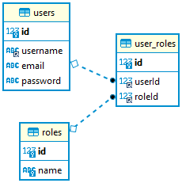
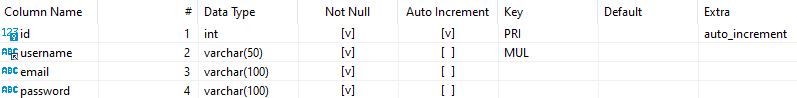
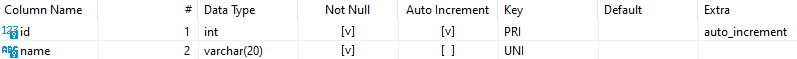
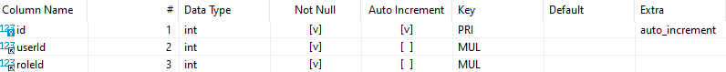
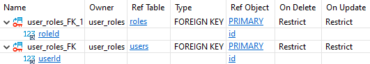

# Spine

***Starting point for a solid back-end with authentication system***

---

## Technologies

- **Runtime**: NodeJS
- **Backend framework**: Express
- **Programming language**: TypeScript
- **Database**: MySQL (npm/mysql2 NodeJS driver)
- **Logging**: Winston
- **Testing**: Jest
- **Mocking**: Sinon
- **Debugging**: VSCode Run and Debug
- **Linting**: ESLint
- **Authentication method**: JWT
- **Design pattern**: Repository-Service-Controller
- **Containerization**: Docker

---

## Database structure

### Entity Relationship Diagram



### Tables

#### users table


#### roles table


#### user_roles table



---

## Development

#### Database
* Set up the dev database (preferably with Docker).
> ```docker run -d --name mysql-spine -v $HOME/dockervols/mysql-spine:/var/lib/mysql/ -e MYSQL_ROOT_PASSWORD=admin --restart unless-stopped -p 3307:3306 mysql:8 --default-authentication-plugin=mysql_native_password```

#### Environment variables
* Copy the `.env.sample` file in `./` and rename it as `.env` and change the variables where needed. 
* The ENV variables are mapped in `./src/config/penv.ts` so they are easy to use throughout the code.

#### Scripts

```bash
npm start # build .dist and start
npm run build # build .dist
npm run lint # check for linting
npm run watch # start watcher
```

#### Debugging
* Install [Visual Studio Code](https://code.visualstudio.com/)
* Start watcher (`npm run watch`)
* In [VS Code Run and Debug](https://code.visualstudio.com/docs/editor/debugging), select `Launch Server` and press ▶️

#### Things to keep in mind
* Follow the design pattern
* JS / TS classes are just syntactic sugar (mind the `this` context for using class methods as middleware (bind with `bind(this)` or use `() => {}`))
* Type as much as possible

---

## Containerization

### Docker Compose

For development purposes, Docker Compose is fully set up and works out of the box. Take a look at the `docker-compose.yml` file in `./` and change it to your needs. Make sure your `.env` file is correctly filled in (see steps above).

To run the Docker Compose environment run `npm run compose`.

### DevOps

#### Building the image

The docker image is built based on the `Dockerfile` in `./`, an `ARG` is required for specifying the port to expose in the build.

For example if you want to expose port x, you would use this command to build the spine image (username, version being your username and version of the app, x being the port you would like to use (e.g. 3000)), don't forget to pass an image tag.

`docker build -t username/spine:version --build-arg PORT=x -f Dockerfile .`

#### Running a container

When running a container, it is important to have the correct config (port mapping, environment variables, ...).

Optionally you can give the container a name, it is important that you correctly map the port specified during build to the desired port on the host machine and pass the port again as an environment variable to listen to within the container. Make sure you pass the correct image tag (the one you specified while building).

>```docker run -d --name spine-server -p 3001:3000 -e HOST_SERVER_PORT=3000 -e NODE_ENV=development -e MYSQL_HOST=127.0.0.1 -e MYSQL_USER=root -e MYSQL_PASSWORD=admin -e MYSQL_PORT=3307 -e JWT_AUTHKEY=somekey axtck/spine:1.0.1```

In development it is not really adviced to launch containers this way (connection will fail due to lack of network setup). You only explicitly create an image when you have a new version of your application and then manage it with a container orchestrator (e.g. Kubernetes) that is responsible for the networking, scaling and more.
